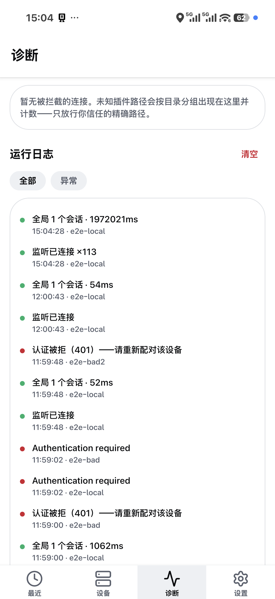

<p align="center">
  
</p>

<p align="center"><b>OpenCode 手机客户端 · 自研增强版</b></p>

<p align="center">
  <a href="LICENSE"></a>
  
  
</p>

> [!NOTE]
> 本仓库基于开源项目 [apuyou/mobilecode](https://github.com/apuyou/mobilecode) 二次开发（1:1 复刻 + 自研增量），与 OpenCode 官方无关联、未获其背书。

---

<p align="center">
  
</p>
<p align="center"><i>诊断页 —— 网关检测、WS 白名单、运行日志与脱敏报告（自研功能）</i></p>
<!-- TODO: 设备回线后补 .github/screenshots/recent.png（最近会话）与 chat.png（聊天+发送键中止）两张截图，
     参考 .maestro/send-stop.yaml 的路径截图即可。 -->

## 这是什么

MobileCode 把跑在电脑上的 [OpenCode](https://opencode.ai) 装进你的手机：手机与电脑在同一局域网（或 VPN）内即可连接服务端，浏览项目与会话、和 AI 编码代理对话——合上电脑也能盯进度、回消息。

客户端使用 OpenCode 的 v2 HTTP/SSE 接口（`@opencode/client`），连接方式为直连（局域网地址或 Tailscale 等 VPN 地址）。

## 功能

### 对话核心

- **多服务器管理**：添加/测试/删除多个服务端
- **项目与会话**：浏览项目、会话列表，新建 / 重命名 / 删除
- **聊天**：流式输出、Markdown 渲染、工具调用卡片、权限与表单横幅、@ 文件引用
- **Agent / 模型**：输入区随手切换；上下文用量表（输入/输出/缓存 vs 窗口）
- **会话操作**：fork 分支继续、compact 压缩历史（均在右上角设置）；运行中发送键一键变中止键
- **多语言**：中文 / English / 日本語（跟随系统）

### 自研增量

- **配对三形态**：QR-JSON / 配对链接 / 配对密钥，token 存 Android Keystore
- **Scan LAN**：/24 有界扫网，一键发现局域网内的服务端
- **设备治理**：设备列表、可达检测、重新配对、删除
- **诊断页**：网关检测、WS 白名单（拦截即计数、按目录分组）、运行日志、脱敏诊断报告
- **语音朗读**：Edge 神经语音自动朗读回复（右上角开关）；长按消息可单条朗读
- **提醒**：未读红点 + 切后台系统通知
- **Material 3 全量换肤**：根主题、导航、输入区、气泡、工具卡均按 M3 roles 重做

## 安装

当前以 APK 侧载分发（包名 `io.memeflyfly.mobilecode`，签名与调试包不兼容，换通道需先卸载）。商店版本开发中。

```bash
# 开发调试（Metro 联调）
bun install
bunx expo run:android

# 发布包（release 签名密钥不入库）
cd android && .\gradlew.bat app:assembleRelease -x lint -x test --build-cache
```

## 快速开始

> [!WARNING]
> 未设置密码时，切勿把 OpenCode 服务端暴露到公网。见 [OpenCode 文档](https://opencode.ai/docs/web/)。

1. 电脑上启动服务端：`opencode web`（局域网内监听）
2. 手机与电脑连接同一 Wi-Fi（或 Tailscale 等 VPN）
3. 打开 MobileCode →「设备」→ 配对（扫码 / 链接 / 密钥），或直接输入服务端地址
4. 到「最近」里开聊

## 技术栈

| 层 | 技术 |
| --- | --- |
| 框架 | Expo SDK 57 + expo-router（RN 0.86） |
| 语言 | TypeScript |
| UI | react-native-paper (M3) + NativeWind (Tailwind) |
| 状态 | Zustand + MMKV 持久化 |
| 数据 | TanStack React Query |
| 接口 | `@opencode/client` v2（HTTP + SSE） |
| 语音 | Edge TTS（`expo-audio`） |
| 包管理 | bun |

## 开发文档

- `AGENTS.md` —— 编码规范（import 双块字母序、必须大括号、禁 `any/unknown`）
- `docs/e2e-runbook.md` —— Maestro 真机 E2E 手册（含 v1→v2 接口对照）
- `.maestro/` —— 冒烟 / 会话列表 / 发送键中止 验证流
- `plan.md` —— 架构与路由草图

## License

[MIT](LICENSE)，沿用上游版权声明。
